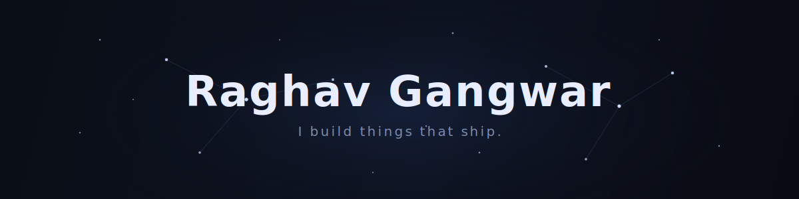

  

  

---

### `// WHO`

I am a pre final year Computer Science student who builds things and actually ships them. Full stack is my home base, but lately most of my energy goes into the AI side of it: agents that do real work, retrieval pipelines that answer from your own documents, and automations that quietly run in the background while you sleep.

I care less about toy demos and more about software that is deployed, used, and a little bit fun to look at. Give me a rough idea and I will turn it into a running product, schema to UI, with the loading states and error handling people usually skip.

Along the way I interned at **EazyDiner** (Full Stack) and **Medulance** (SDE), where I owned features end to end and learned what shipping under a real sprint deadline feels like. When I am not building, I am usually breaking down a new tool, grinding DSA for placements, or refactoring something that already worked just because it could be cleaner.

Always down to build something interesting. If you have a hard problem, I want to hear about it.

 

---

### `// BUILDING`

**[RAG Document Intelligence Platform](https://nexus-ai-theta-seven.vercel.app)** &nbsp;`FastAPI` `PostgreSQL` `MongoDB` `Docker`
Upload your documents, ask questions, get answers grounded in the source. Full retrieval pipeline with a streaming response UI, fully containerized.

**[Agentic Interview Coach](https://github.com/SheinRG/Agentic-Interview-coach-)** &nbsp;`React` `Express` `WebSockets` `Multi LLM`
Live interview practice with real time feedback, multi model orchestration, and automatic failover when a provider goes down. Tracks your progress across sessions.

**[AI Image Generation Platform](ADD_LIVE_LINK_HERE)** &nbsp;`React` `Express` `TypeScript` `Cloudinary`
Generate, store, and browse AI images through a searchable, lazy loaded gallery with a Cloudinary upload pipeline.

**[BookLeaf Author Support Portal](https://bookleaf-mauve.vercel.app)** &nbsp;`MERN` `RBAC` `AI Classification`
Role based author support portal with AI ticket classification and end to end access control.

**Author Royalty Dashboard** &nbsp;`Bubble.io` `n8n` `Groq` `Webhooks`
Royalty tracking dashboard with an automated email notification system wired through n8n and Groq.

 

---

### `// STACK`

---

### `// CONNECT`

 

  

Systems, agents, and the occasional 3am deploy.

